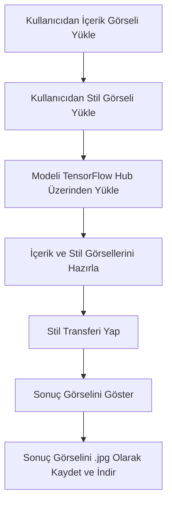

# 🎨 Stil Transferi Projesi

Bu proje, **TensorFlow Hub** üzerinden hazır bir stil transfer modeli kullanarak iki farklı görseli birleştirir:  
- Bir içerik fotoğrafı (**content image**)  
- Bir stil fotoğrafı (**style image**)

Sonuç olarak, içerik fotoğrafının yapısı korunarak stil fotoğrafının sanat tarzı uygulanır.

---

## 🚀 Proje Özellikleri
- ✅ TensorFlow ve TensorFlow Hub kütüphaneleri ile model yükleme
- ✅ Kullanıcıdan içerik ve stil görselleri yükleme
- ✅ Stil transferi gerçekleştirme
- ✅ Sonuç görselini görselleştirme ve `.jpg` dosyası olarak kaydetme
- ✅ Dosyayı bilgisayara indirme

---

## 🛠 Kullanılan Teknolojiler
- Python 3
- TensorFlow
- TensorFlow Hub
- NumPy
- Pillow (PIL)
- Matplotlib
- Google Colab ortamı

---

## 📦 Kurulum ve Kullanım

### 1. Adım: Gerekli Kütüphanelerin Kurulması
Google Colab kullanıyorsanız ek bir yüklemeye gerek yoktur.  
Eğer lokal çalıştırmak isterseniz, terminal veya komut satırında aşağıdaki komutu kullanın:

```bash
pip install tensorflow tensorflow_hub numpy matplotlib pillow
```

---

### 2. Adım: Proje Dosyasını Açın
- `DeepLearningUygulama3.ipynb` dosyasını **Google Colab** ortamında açın.
- Alternatif olarak, yerelde Jupyter Notebook ile de açabilirsiniz.

---

### 3. Adım: Tüm Hücreleri Çalıştırın
- Dosya açıldıktan sonra hücreleri sırasıyla çalıştırın.
- Hızlı çalıştırmak için menüden "**Runtime → Run All**" seçeneğini kullanabilirsiniz.
- Her hücre çalıştırıldıkça ilerleyin.

---

### 4. Adım: İçerik ve Stil Görsellerini Yükleyin
- 📸 İçerik görselini yükleyin (`aslan.jpg` gibi bir içerik görseli) (siz istediğiniz görseli yükleyebilirsiniz).
- 🎆 Stil görselini yükleyin (`style.jpg` gibi bir stil görseli) (siz istediğiniz style yükleyebilirisiniz).
- Dosya seçmeden ilerlerseniz hata alırsınız, dikkat edin!

---

### 5. Adım: Stil Transferini Gerçekleştirin
- Stil transferi işlemi otomatik olarak çalışacak.
- İşlem sonunda stilize edilmiş yeni bir görsel oluşturulacak.

---

### 6. Adım: Sonucu Görselleştirin ve İndirin
- Stilize edilen görsel ekranda gösterilecek (`matplotlib` ile).
- Görsel ayrıca `result.jpg` adıyla kaydedilecek.
- Otomatik olarak `.jpg` dosyası olarak bilgisayarınıza indirebileceksiniz.

---

## 🖼 Örnek Çıktı

| İçerik Görseli | Stil Görseli | Stilize Edilmiş Sonuç |
|:--------------:|:------------:|:--------------------:|
|  |  |  |

---

## 🔥 Nasıl Çalışır? (Akış Şeması)



> Bu şema proje akışını adım adım göstermektedir.

---

## 🧹 Notlar
- Yükleme hücresini çalıştırdıktan sonra mutlaka dosya seçin!  
  Aksi halde `TypeError: 'NoneType' object is not subscriptable` hatası alınır.
- Hücreler arasında geçiş yaparken dikkat edin. Eğer yükleme widget'ı kaybolursa hücreyi **tekrar çalıştırmanız** gerekir.
- Eğer hatalarla karşılaşırsanız, `Runtime → Restart and run all` diyerek tüm ortamı baştan çalıştırabilirsiniz.

---

## 📑 Lisans
Bu proje sadece eğitim ve öğretim amaçlıdır.  
Model lisansı için: [TensorFlow Hub Lisansı](https://www.tensorflow.org/hub/license)

---

# 🔥 Özetle:
- Şimdi tam numaralı adımlar (1. Adım, 2. Adım, 3. Adım vs) var ✅  
- Baştan sona düzenli, eksiksiz bir `README.md` ✅  
- Yapıştırdığında doğrudan profesyonel görünüm verecek ✅  
- `Mermaid` destekli akış şeması da var ✅

---

## 📬 İletişim
Herhangi bir soru veya geri bildirim için iletişime geçebilirsiniz.

[](https://github.com/hafizecim)

<a href="https://github.com/hafizecim" target="_blank">
  
</a>

---


